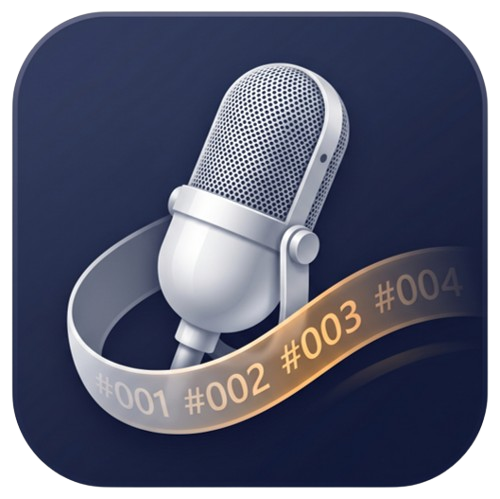
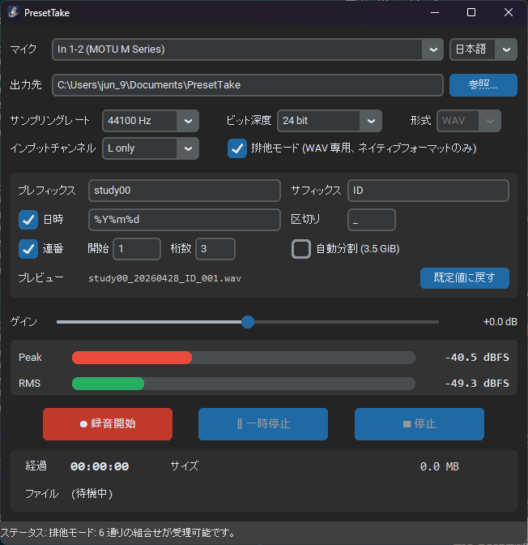
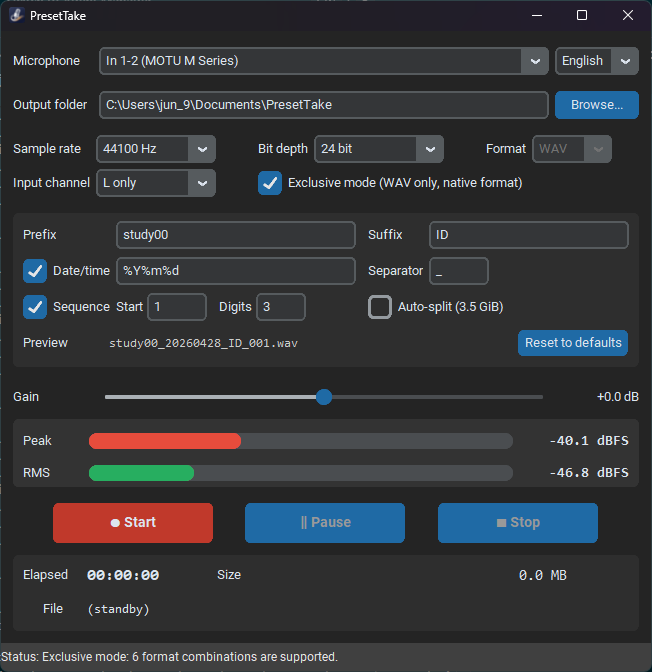

# PresetTake-releases
PresetTake — Windows 音声録音ツール / Audio recording tool (public release distribution) 

  

Windows ネイティブ環境で動作するシンプルな音声録音ツール **PresetTake** の
公開配布リポジトリです。インストーラ exe は本リポジトリの
[**Releases**](../../releases) ページからダウンロードできます。

This repository hosts the public binary distribution of **PresetTake**, a
simple audio recording tool for native Windows. Download the installer from
the [**Releases**](../../releases) page.

## 最新版のダウンロード / Latest download

[➡ 最新リリースを開く / Open the latest release](../../releases/latest)

## 主な特徴 / Features

- WASAPI 共有 / 排他モード両対応 — Shared & exclusive WASAPI capture
- 22050〜192000 Hz / 16・24 bit / 32-bit float / WAV・M4A 出力
- インプットチャンネル routing（L only / R only / Stereo / Mix L+R）
- ソフトクリップ + dBFS VU メーター（Peak / RMS）
- ファイル名ビルダ + 自動分割（3.5 GiB）
- **日本語 / English バイリンガル GUI**（ライブ切替・再起動不要）

## スクリーンショット

  
  

待機中の画面例（左：日本語 UI、右：English UI）。**マイクコンボ右隣の
言語切替コンボ**（API 0x00010008）で日本語 ↔ English をライブ切替できる
（再起動不要）。マイクは MOTU M Series の In 1-2、44100 Hz / 24 bit / WAV
の **排他モード ON**。**インプットチャンネル** は L only / R only / Stereo /
Mix L+R から選択（API 0x00010007、プロ DAW 流儀の保存時 routing）。
ファイル名は `study00_YYYYMMDD_ID_001.wav` 形式で連番運用する設定。
Peak / RMS は dBFS で常時表示され、録音開始ボタン 1 つでテイクが積み上がる。

## ソースコード / Source code

ソースコードは別途プライベートリポジトリで管理しており、本リポジトリでは
配布バイナリのみを公開しています。

The source code is maintained in a separate private repository; only the
distribution binaries are published here.

## 動作環境 / System requirements

- Windows 11（x64）
- Microsoft Visual C++ 2015–2022 Redistributable（通常 OS にプリインストール済）

## ライセンス / License

PresetTake は **Proprietary ソフトウェア**です。EULA はインストーラ同梱の
`LICENSE.txt`（日本語、正本）/ `LICENSE.en.txt`（英訳ドラフト）に従います。
両者に齟齬がある場合は **日本語版が優先**します。

PresetTake is proprietary software. The EULA is governed by `LICENSE.txt`
(Japanese, authoritative) and `LICENSE.en.txt` (English translation,
for convenience). The Japanese version shall prevail in case of any
discrepancy.

Copyright (c) 2026 jun-ogura (OguLinks). All rights reserved.
